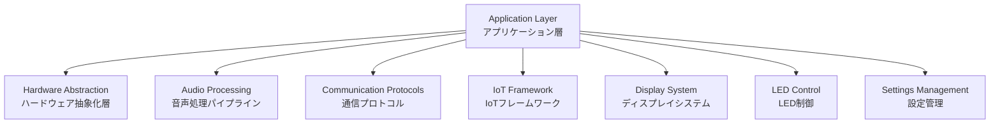
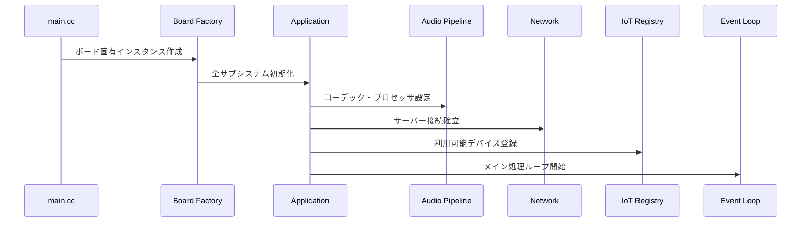
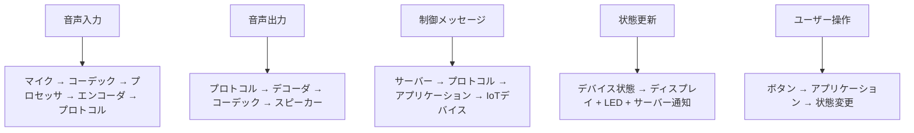

# XiaoZhi ESP32 アーキテクチャドキュメント

## プロジェクト概要

XiaoZhi ESP32は、ESP32マイクロコントローラーベースの高機能AIチャットボットデバイスエコシステムです。音声インタラクション機能、多言語サポート、ディスプレイ出力、IoTデバイス制御を提供し、60種類以上の異なるハードウェアボードをサポートするモジュラーで拡張可能なアーキテクチャを実装しています。

## システムアーキテクチャ概要



## 1. アプリケーション層 - 中央制御システム

### メインコンポーネント: `Application` クラス（シングルトン）

**場所**: `main/application.h/cc`

**役割**: システム全体のコンポーネントを管理する中央オーケストレーター

#### 主要な設計パターン:
- **シングルトンパターン**: システム全体で単一インスタンスを保証
- **イベント駆動アーキテクチャ**: FreeRTOSイベントグループを使用した状態同期
- **オブザーバーパターン**: 音声・状態変更用コールバック管理

#### 核となる責任:
- **デバイス状態管理**: 10の異なるデバイス状態を制御
  ```cpp
  enum State {
      kUnknown = 0,     // 不明
      kStarting,        // 開始中
      kConfiguring,     // 設定中
      kIdle,           // アイドル
      kConnecting,     // 接続中
      kListening,      // 聞き取り中
      kSpeaking,       // 発話中
      kUpgrading,      // アップグレード中
      kActivating,     // アクティベーション中
      kFatalError      // 致命的エラー
  };
  ```

- **音声パイプライン制御**: 完全な音声処理フローを管理
- **プロトコル通信**: WebSocket/MQTTメッセージルーティング
- **バックグラウンドタスクスケジューリング**: ノンブロッキング操作の管理
- **OTAアップデート**: ファームウェアアップグレードの調整

#### データフロー:
1. ウェイクワード検出 → 音声録音開始
2. 音声をOpusで圧縮 → プロトコル経由でサーバーに送信
3. サーバー応答 → 音声再生 + 制御メッセージ処理
4. サーバーコマンドに基づくIoTデバイス更新

## 2. ハードウェア抽象化層 - マルチボードサポート

### ベースアーキテクチャ: `Board` クラス階層

**場所**: `main/boards/common/board.h`

#### 主要な設計パターン:
- **ファクトリーパターン**: `DECLARE_BOARD`マクロによる自動ファクトリー関数生成
- **テンプレートメソッドパターン**: 標準化された初期化シーケンス
- **ストラテジーパターン**: 異なるネットワーク実装（WiFi、ML307、デュアル）

#### ボード構造:
各ボードディレクトリには以下が含まれます：
- **実装ファイル** (`.cc`): ボード固有のハードウェア設定
- **ピン設定** (`config.h`): GPIOピンマッピングとハードウェア設定
- **ビルド設定** (`config.json`): コンパイル設定と依存関係
- **カスタムコンポーネント**: ボード固有の音声コーデック、電源管理、ディスプレイ

#### ボードカテゴリー:
- **WifiBoard**: 標準WiFi対応デバイス（Boardから継承）
- **ML307Board**: セルラー/4G接続ボード
- **DualNetworkBoard**: WiFiとセルラー両方をサポートするボード

#### ファクトリー登録プロセス:
```cpp
DECLARE_BOARD(EspBox3Board)
// 以下に展開される:
void* create_board() { return new EspBox3Board(); }
```

### サポートボード例:
- **ESP-Box**: Espressif公式開発ボード
- **M5Stack Core S3**: M5Stack製高機能ボード
- **Atom Echo Base**: 小型音声デバイス
- **LilyGO T-Circle S3**: 円形ディスプレイ搭載
- **SenseCAP Watcher**: AIカメラ統合ボード

## 3. 音声処理パイプライン - マルチステージ処理

### 音声コーデック層

**場所**: `main/audio_codecs/`

**ベースクラス**: `AudioCodec` - I2Sインターフェース抽象化

#### サポートされるコーデック:
- **ES8311**: 高性能音声コーデック
- **ES8374**: 多機能音声コーデック  
- **ES8388**: ステレオ音声コーデック
- **Box Audio Codec**: ESP-Box専用コーデック
- **No Audio Codec**: 音声機能なしボード用

### 音声プロセッサ層

**場所**: `main/audio_processing/`

**実装**: `AfeAudioProcessor`（AEC付き）または `DummyAudioProcessor`

#### 機能:
- **音響エコーキャンセレーション（AEC）**: エコー除去
- **音声活動検出（VAD）**: 音声の有無判定
- **ノイズリダクション**: 背景ノイズ除去

### 音声フローパイプライン:


#### 詳細なフロー:
1. **入力**: マイク → I2S → 音声コーデック
2. **処理**: AFEプロセッサ（AEC、VAD、ノイズリダクション）
3. **エンコード**: Opus圧縮（60msフレーム）
4. **送信**: WebSocket/MQTT経由でサーバーへ
5. **受信**: サーバー応答 → Opusデコード
6. **出力**: 音声コーデック → I2S → スピーカー

### ウェイクワード検出:
- **コンポーネント**: `WakeWordDetect` - ESP-SRライブラリ使用
- **統合**: 録音開始トリガー、中断シナリオ管理

## 4. 通信プロトコル - ネットワーク抽象化

### プロトコルアーキテクチャ

**場所**: `main/protocols/`

**ベースインターフェース**: `Protocol` クラス - 統一API

**実装**: `WebsocketProtocol`, `MqttProtocol`

#### メッセージフォーマット:

##### バイナリプロトコル（音声用）:
```cpp
struct BinaryProtocol2 {
    uint16_t version;       // プロトコルバージョン
    uint16_t type;          // メッセージタイプ（0: OPUS, 1: JSON）
    uint32_t reserved;      // 将来の拡張用
    uint32_t timestamp;     // サーバーサイドAEC用タイムスタンプ
    uint32_t payload_size;  // ペイロードサイズ
    uint8_t payload[];      // 音声データ（Opusエンコード済み）
}
```

##### JSONプロトコル（制御用）:
- IoTデバイス状態とコマンド
- セッション管理
- エラーハンドリング
- ウェイクワード通知

#### 接続管理:
- **セッションID追跡**: 通信状態の維持
- **エラー復旧**: 指数バックオフによる自動再接続
- **タイムアウトハンドリング**: ハング接続の防止

### WebSocketプロトコル:
- **リアルタイム通信**: 低レイテンシー音声伝送
- **バイナリサポート**: 効率的な音声データ転送
- **ハートビート**: 接続維持メカニズム

### MQTTプロトコル:
- **ハイブリッド設計**: MQTT + UDP組み合わせ
- **QoS管理**: メッセージ配信保証
- **セキュリティ**: TLS暗号化とAES暗号化

## 5. IoTフレームワーク - デバイス制御システム

### コアコンポーネント

**場所**: `main/iot/`

**ベースクラス**: `Thing` - 抽象IoTデバイス表現

**マネージャー**: `ThingManager`（シングルトン） - デバイスレジストリと状態管理

#### IoTアーキテクチャ:

##### Thing定義:
- **プロパティ**: 読み取り専用デバイス状態（バッテリーレベル、温度、ON/OFF状態）
- **メソッド**: パラメータ付き音声制御可能アクション
- **タイプ**: Boolean、Number、String値

##### 組み込みThings:
- **Speaker**: 音量制御と音声出力管理
- **Screen**: ディスプレイ制御とテーマ管理
- **Battery**: 電力レベル監視
- **Lamp**: LEDと照明制御

#### 設計パターン:
- **ファクトリーパターン**: `DECLARE_THING`マクロによる自動登録
- **コマンドパターン**: パラメータ検証付きメソッド呼び出し
- **ステートパターン**: プロパティゲッターによるリアルタイムデバイス状態提供

#### 音声統合:
1. サーバーが音声コマンドを処理
2. JSON制御メッセージを送信
3. ThingManagerが適切なThingにルーティング
4. Thingがパラメータ付きメソッドを実行
5. 状態変更が次回更新で反映

## 6. ディスプレイシステム - マルチディスプレイサポート

### ディスプレイアーキテクチャ

**場所**: `main/display/`

**ベースクラス**: `Display` - LVGLグラフィックライブラリ使用

**実装**: `LcdDisplay`, `OledDisplay`, `NoDisplay`

#### UIコンポーネント:
- **ステータスバー**: ネットワーク、バッテリー、ミュートインジケーター
- **ステータステキスト**: 現在の操作表示
- **通知**: 自動消去付き一時メッセージ
- **チャットメッセージ**: 会話履歴
- **エモーション**: 視覚的フィードバック表現
- **アイコン**: Font Awesomeシンボル統合

#### テーマシステム:
- **ライト/ダークテーマ**: 動的テーマ切り替え
- **フォント管理**: 多言語フォントサポート
- **カスタムスタイリング**: ボード固有の視覚的適応

### 対応ディスプレイタイプ:
- **LCD**: RGB、MIPI、SPI、QSPI、MCU8080インターフェース
- **OLED**: I2C、SPI接続
- **AMOLED**: 高解像度カラーディスプレイ
- **タッチスクリーン**: 容量性タッチ入力

## 7. LED制御システム - ステータス表示

### LEDアーキテクチャ

**場所**: `main/led/`

**ベースインターフェース**: `Led` クラス - 状態変更通知付き

**実装**: `SingleLed`, `CircularStrip`, `GpioLed`, `NoLed`

#### LEDパターン:
- 色とパターンによるデバイス状態可視化
- ステータス表示（接続中、聞き取り中、発話中、エラー）
- ボード固有LED設定

#### 状態表示例:
- **青色点滅**: WiFi接続中
- **緑色常時点灯**: アイドル状態
- **赤色点滅**: エラー状態
- **白色パルス**: 聞き取り中
- **黄色フェード**: 発話中

## 8. 設定管理 - 永続的設定

### 設定システム

**場所**: `main/settings.h/cc`

**ストレージ**: ESP32 NVS（Non-Volatile Storage）

**データタイプ**: 文字列、整数キーバリューペア

**ネームスペース**: 機能ドメインによる整理

#### 永続的設定:
- WiFi認証情報とネットワーク設定
- 音声音量とコーデック設定
- ディスプレイ明度とテーマ設定
- デバイスアクティベーションとサーバー設定
- ユーザー設定と言語設定

#### NVS構造:
```cpp
class Settings {
private:
    std::string ns_;                // NVSネームスペース名
    nvs_handle_t nvs_handle_ = 0;   // NVSハンドル
    bool read_write_ = false;       // 書き込み権限フラグ
    
public:
    std::string GetString(const std::string& key, const std::string& default_value = "");
    void SetString(const std::string& key, const std::string& value);
    int32_t GetInt(const std::string& key, int32_t default_value = 0);
    void SetInt(const std::string& key, int32_t value);
};
```

## 主要な設計パターン

### 1. シングルトンパターン
```cpp
class Application {
public:
    static Application& GetInstance() {
        static Application instance;
        return instance;
    }
private:
    Application() = default;
    Application(const Application&) = delete;
    Application& operator=(const Application&) = delete;
};
```

### 2. ファクトリーパターン
```cpp
#define DECLARE_BOARD(board_class) \
extern "C" void* create_board() { \
    return new board_class(); \
}
```

### 3. オブザーバーパターン
```cpp
class Protocol {
protected:
    std::function<void(const std::string&)> on_text_message_received_;
    std::function<void(const std::vector<uint8_t>&)> on_audio_message_received_;
public:
    void SetOnTextMessageReceived(std::function<void(const std::string&)> callback);
    void SetOnAudioMessageReceived(std::function<void(const std::vector<uint8_t>&)> callback);
};
```

### 4. ストラテジーパターン
```cpp
// 異なる音声プロセッサ実装
#if CONFIG_USE_AUDIO_PROCESSOR
    audio_processor_ = std::make_unique<AfeAudioProcessor>();
#else
    audio_processor_ = std::make_unique<DummyAudioProcessor>();
#endif
```

## コンポーネント間相互作用とデータフロー

### 初期化シーケンス:


### ランタイムデータフロー:


## 設定とビルドシステム

### マルチボードサポート:
- **Menuconfig**: ESP-IDF設定システム
- **ボード選択**: コンパイル時ボードタイプ選択
- **機能トグル**: AEC、ウェイクワード、ディスプレイオプション
- **言語選択**: 多言語アセットコンパイル

### 重要なビルド依存関係:
- **ESP-IDF 5.3+**: 最新機能に必要
- **LVGL**: グラフィックとUIフレームワーク
- **ESP-SR**: ウェイクワード検出ライブラリ
- **Opus**: 音声圧縮コーデック
- **cJSON**: JSON解析と生成

### ビルドコマンド例:
```bash
# プロジェクト設定（ボードとオプション選択）
idf.py menuconfig

# プロジェクトビルド
idf.py build

# デバイスにフラッシュ
idf.py -p /dev/ttyUSB0 flash monitor

# 全ボード向けリリースビルド
python scripts/release.py
```

## パフォーマンスと最適化

### メモリ管理:
- **ヒープ監視**: リアルタイムメモリ使用量追跡
- **タスクスタック最適化**: 各タスクの最小スタックサイズ
- **DMAバッファ**: 効率的な音声データ転送

### リアルタイム性能:
- **音声レイテンシ**: 60ms以下のend-to-endレイテンシ
- **プロトコル最適化**: バイナリフォーマットによる帯域幅節約
- **並行処理**: FreeRTOSタスクによる並行音声処理

### 電力効率:
- **スリープモード**: アイドル時の低電力消費
- **動的周波数調整**: 負荷に応じたCPU周波数制御
- **ペリフェラル電源管理**: 未使用コンポーネントの電源オフ

## セキュリティと暗号化

### 通信セキュリティ:
- **TLS 1.2/1.3**: WebSocket/MQTT接続の暗号化
- **証明書検証**: サーバー認証の確認
- **AES暗号化**: MQTTプロトコルでの追加暗号化層

### デバイスセキュリティ:
- **セキュアブート**: ファームウェア整合性検証
- **フラッシュ暗号化**: 機密データの保護
- **OTA署名検証**: アップデート時の改ざん防止

## 拡張性と将来性

### 新機能追加:
- **プラグアーキテクチャ**: 新しいボードやコーデックの簡単追加
- **モジュラー設計**: 機能の有効/無効切り替え
- **API安定性**: 下位互換性の維持

### 開発者エコシステム:
- **包括的ドキュメント**: アーキテクチャと API文書
- **例とテンプレート**: 新しいボード/機能の開発ガイド
- **テストフレームワーク**: 自動テストとCI/CD統合

このアーキテクチャは、明確な関心の分離、広範なハードウェア抽象化、スケーラブルなコンポーネント統合を備えた、よく設計された組み込みシステムを示しています。モジュラー設計により、一貫したAPIとユーザーエクスペリエンスを維持しながら、新しいボード、音声コーデック、ディスプレイ、IoTデバイスを簡単に追加できます。