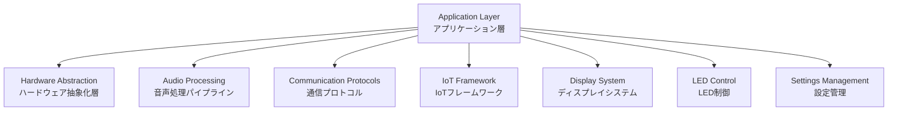
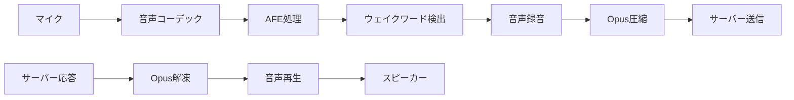

# XiaoZhi ESP32 アーキテクチャドキュメント

## プロジェクト概要

XiaoZhi ESP32は、ESP32マイクロコントローラーを使用したAI音声アシスタントデバイスです。このプロジェクトの目的は、「小智（XiaoZhi）」という名前のAIアシスタントと自然な音声での対話を可能にすることです。

### このシステムが実現すること

このシステムは、以下のような流れで動作します：

1. **ユーザーがウェイクワード「小智」と呼びかける**
2. **デバイスが音声を認識し、録音を開始する**
3. **録音した音声をサーバーに送信し、AIが応答を生成する**
4. **AIの応答をスピーカーから再生する**
5. **必要に応じて、照明や他のIoTデバイスを制御する**

このシステムの特徴は、60種類以上の異なるハードウェアボード（ESP-Box、M5Stack、Atom Echo等）で動作することです。各ボードには異なる音声コーデック、ディスプレイ、LED、ボタンが搭載されていますが、同じソフトウェアで統一的に制御できるように設計されています。

### システムの主な機能

- **音声認識と応答**: ユーザーの音声を理解し、自然な音声で回答
- **多言語対応**: 日本語、中国語、英語での音声対話
- **IoTデバイス制御**: 音声コマンドで照明、スクリーン、その他のデバイスを操作
- **リアルタイム通信**: 低遅延でサーバーとの音声データ交換
- **視覚的フィードバック**: ディスプレイやLEDによる状態表示
- **Over-The-Air更新**: ネットワーク経由でのファームウェア自動更新

## システムアーキテクチャ概要



## 1. アプリケーション層 - 中央制御システム

### システムの中枢：Applicationクラス

**場所**: `main/application.h/cc`

Applicationクラスは、XiaoZhi ESP32システム全体を統括する「指揮者」のような役割を果たします。このクラスは、システム全体で唯一のインスタンス（シングルトン）として動作し、すべてのコンポーネントを協調させて動作させます。

#### システムが行う具体的な処理

**1. デバイスの起動処理**
システムが電源オンされると、Applicationクラスは以下の順序で初期化を行います：

- **ハードウェアの検出と初期化**: 接続されているボードの種類を判定し、対応する音声コーデック、ディスプレイ、LEDを初期化
- **WiFi接続の確立**: 保存されているWiFi設定を使用してネットワークに接続
- **サーバー接続**: 音声認識AIサーバーとの通信チャンネルを確立
- **音声システムの準備**: マイクとスピーカーのテスト、音声処理エンジンの起動

**2. デバイス状態の管理**
システムは常に現在の状態を把握し、適切な動作を行います：

```cpp
enum State {
    kUnknown = 0,     // 不明：起動直後の初期状態
    kStarting,        // 開始中：システム初期化処理中
    kConfiguring,     // 設定中：WiFi設定やアクティベーション待ち
    kIdle,           // アイドル：待機状態、ウェイクワードを監視
    kConnecting,     // 接続中：サーバーとの接続確立中
    kListening,      // 聞き取り中：ユーザーの音声を録音中
    kSpeaking,       // 発話中：AIの応答音声を再生中
    kUpgrading,      // アップグレード中：ファームウェア更新中
    kActivating,     // アクティベーション中：デバイス登録処理中
    kFatalError      // 致命的エラー：復旧不可能なエラー状態
};
```

**3. 音声対話の制御フロー**
実際の音声対話は以下のように処理されます：

- **待機状態（kIdle）**: ウェイクワード「小智」を常時監視
- **ウェイクワード検出**: ESP-SRライブラリがウェイクワードを認識すると、状態を「聞き取り中（kListening）」に変更
- **音声録音**: ユーザーの音声をリアルタイムで録音し、60ミリ秒ごとのチャンクに分割
- **音声送信**: 録音された音声をOpus形式で圧縮し、WebSocketまたはMQTT経由でサーバーに送信
- **応答受信**: サーバーからの応答（音声データと制御コマンド）を受信
- **音声再生**: 状態を「発話中（kSpeaking）」に変更し、AIの応答音声をスピーカーから再生
- **デバイス制御**: 必要に応じて照明やディスプレイなどのIoTデバイスを制御

**4. バックグラウンド処理の管理**
Applicationクラスは、メインの音声処理をブロックしないように、以下の処理を別スレッドで実行します：

- **定期的なシステムヘルスチェック**: メモリ使用量やネットワーク状態の監視
- **ファームウェア更新チェック**: サーバーから新しいバージョンの通知を受信した場合の更新処理
- **設定の保存**: ユーザー設定の変更をNVS（不揮発性ストレージ）に保存
- **ログの管理**: デバッグ情報やエラーログの記録と送信

#### イベント駆動アーキテクチャの活用

システムは、FreeRTOSのイベントグループ機能を使用して、異なるコンポーネント間の同期を行います。例えば：

- 音声コーデックが新しい音声データを受信したとき
- ネットワーク接続が確立または切断されたとき  
- ユーザーがボタンを押したとき
- サーバーからメッセージを受信したとき

これらのイベントが発生すると、該当するコンポーネントに通知が送られ、適切な処理が実行されます。

## 2. ハードウェア抽象化層 - マルチボードサポート

### 多様なハードウェアを統一的に制御する仕組み

**場所**: `main/boards/common/board.h`

ハードウェア抽象化層は、XiaoZhi ESP32プロジェクトの最も重要な特徴の一つです。この層により、60種類以上の異なるハードウェアボードで同じソフトウェアを動作させることができます。

#### なぜハードウェア抽象化が必要なのか

ESP32エコシステムには、数多くの開発ボードが存在します：
- **ESP-Box**: Espressif公式の大型ディスプレイ付きボード
- **M5Stack Core S3**: 小型で高機能なスタックable ボード
- **Atom Echo**: 手のひらサイズの音声専用デバイス
- **LilyGO T-Circle S3**: 円形ディスプレイを搭載した特殊なボード

これらのボードは、音声コーデック、ディスプレイサイズ、LED配置、ボタン数など、ハードウェア構成が大きく異なります。しかし、ユーザーにとってはどのボードでも同じように「小智と対話できる」ことが重要です。

#### 具体的な抽象化の仕組み

**1. ボードの自動検出と初期化**
システム起動時に、以下の処理が行われます：

```cpp
// コンパイル時にボードタイプが決定され、対応するファクトリー関数が呼ばれる
DECLARE_BOARD(EspBox3Board)
// これが以下のコードを自動生成：
void* create_board() { return new EspBox3Board(); }
```

**2. 各ボードの設定構造**
各ボードディレクトリには、そのボード固有の設定が含まれます：

- **`config.h`** - ハードウェアピン配置：
  ```cpp
  #define I2S_BCK_PIN 16      // 音声用クロックピン
  #define I2S_WS_PIN 17       // 音声用ワードセレクトピン
  #define I2S_DATA_PIN 15     // 音声用データピン
  #define LED_PIN 2           // LED制御ピン
  #define BUTTON_PIN 0        // ボタン入力ピン
  ```

- **`config.json`** - ビルド時設定：
  ```json
  {
    "audio_codec": "es8311",     // 使用する音声コーデック
    "display_type": "lcd",       // ディスプレイタイプ
    "display_width": 320,        // ディスプレイ幅
    "display_height": 240,       // ディスプレイ高さ
    "led_type": "single"         // LED制御方式
  }
  ```

- **実装ファイル** (`.cc`) - ボード固有の初期化処理：
  ```cpp
  void EspBox3Board::Initialize() {
      // ESP-Box3専用の初期化処理
      SetupAudioCodec();    // ES8311コーデックの設定
      SetupDisplay();       // 2.4インチLCDの設定
      SetupButtons();       // タッチボタンの設定
      SetupLEDs();          // RGB LEDストリップの設定
  }
  ```

**3. 異なるネットワーク接続方式のサポート**

ボードによって、接続方式が異なります：

- **WifiBoard**: 一般的なWiFi接続のみ
  ```cpp
  class WifiBoard : public Board {
      void ConnectToNetwork() override {
          // WiFi接続処理
          WiFi.begin(ssid, password);
      }
  };
  ```

- **ML307Board**: 4G/LTE セルラー接続
  ```cpp
  class ML307Board : public Board {
      void ConnectToNetwork() override {
          // ML307モデムを使用したセルラー接続
          ml307_modem.connect(apn, username, password);
      }
  };
  ```

- **DualNetworkBoard**: WiFiと4G両方をサポート
  ```cpp
  class DualNetworkBoard : public Board {
      void ConnectToNetwork() override {
          // まずWiFiを試行、失敗したら4Gに切り替え
          if (!connectWifi()) {
              connectCellular();
          }
      }
  };
  ```

#### 実際の動作例：ESP-Box3での音声処理

ESP-Box3ボードで音声対話を行う場合の具体的な処理：

1. **ハードウェア初期化**:
   - ES8311音声コーデックを初期化
   - I2S（Inter-IC Sound）バスを設定
   - マイクとスピーカーの入出力レベルを調整

2. **ウェイクワード検出**:
   - マイクからの音声をリアルタイムで監視
   - ESP-SRライブラリが「小智」を検出

3. **音声録音**:
   - ES8311がアナログ音声をデジタルに変換
   - I2Sバス経由でESP32に16bit/16kHzサンプルを転送
   - AFE（Audio Front End）プロセッサがノイズ除去とエコーキャンセレーションを実行

4. **音声再生**:
   - サーバーからの応答音声をOpus形式でデコード
   - ES8311がデジタル音声をアナログに変換
   - スピーカーから音声を出力

#### Atom Echoでの同じ処理

同じソフトウェアがAtom Echoボードでも動作しますが、ハードウェア設定は大きく異なります：

1. **ハードウェア初期化**:
   - I2S内蔵DACを使用（専用コーデックなし）
   - 小型マイクのゲイン調整
   - 単色LEDの初期化

2. **制約の自動対応**:
   - ディスプレイなし → テキスト表示は無効化
   - ボタン一つのみ → 長押し/短押しで複数機能を実現
   - 小型スピーカー → 音量レベルを自動調整

この抽象化により、開発者は各ボードの細かいハードウェア差異を意識することなく、音声対話機能の開発に集中できます。

## 3. 音声処理パイプライン - 高品質な音声対話を実現する技術

### 音声処理の全体的な流れ

音声処理パイプラインは、XiaoZhi ESP32の核心となる技術です。人間の音声を正確に認識し、AIの応答を自然に再生するために、複数の高度な技術を組み合わせています。



### 音声コーデック層 - ハードウェアと音声の橋渡し

**場所**: `main/audio_codecs/`

音声コーデックは、アナログの音声信号とデジタルデータを相互変換する重要な役割を果たします。

#### 各コーデックの特徴と用途

**1. ES8311コーデック**
- **使用ボード**: ESP-Box3、M5Stack Core S3など
- **特徴**: 高音質・低ノイズ・ステレオサポート
- **具体的な処理**:
  ```cpp
  // マイクからの音声入力
  int16_t audio_buffer[1024];
  es8311_codec.Read(audio_buffer, 1024);  // 16bit/16kHzでサンプリング
  
  // スピーカーへの音声出力
  es8311_codec.Write(audio_buffer, 1024); // DACでアナログ変換
  ```

**2. ESP-Box専用コーデック**
- **使用ボード**: ESP-Box、ESP-Box-Lite
- **特徴**: Espressif最適化・低消費電力
- **自動ゲイン制御**: 音量レベルを環境に応じて自動調整

**3. 内蔵DAC使用（No Audio Codec）**
- **使用ボード**: Atom Echo、シンプルなボード
- **特徴**: 外部コーデック不要・コスト削減
- **制約**: 音質は劣るが十分実用的

#### 実際の音声変換処理

音声コーデックが行う具体的な処理：

1. **アナログ→デジタル変換（録音時）**:
   ```
   マイク音声（アナログ） → ADC → 16bit サンプル → I2Sバス → ESP32
   ├─ サンプリング周波数: 16kHz（人間の音声に最適）
   ├─ ビット深度: 16bit（高音質と処理速度のバランス）
   └─ チャンネル: モノラル（会話用途に十分）
   ```

2. **デジタル→アナログ変換（再生時）**:
   ```
   ESP32 → I2Sバス → 16bit サンプル → DAC → アナログ音声 → スピーカー
   ├─ 音量制御: ソフトウェアでデジタル制御
   ├─ フィルタリング: 高周波ノイズ除去
   └─ 増幅: スピーカー駆動に必要なレベルまで増幅
   ```

### AFE（Audio Front End）プロセッサ - 音声品質の向上

**場所**: `main/audio_processing/`

AFEプロセッサは、Espressifが開発した高度な音声処理エンジンです。これにより、ノイズの多い環境でも正確な音声認識が可能になります。

#### AEC（音響エコーキャンセレーション）の動作原理

**問題**: スピーカーから出力された音声がマイクに回り込み、エコーとして録音されてしまう

**解決方法**:
1. **参照信号の生成**: スピーカーに送られる音声データをコピー
2. **エコー予測**: 参照信号から予想されるエコーをモデル化
3. **エコー除去**: マイク入力から予測エコーを差し引く

```cpp
// AEC処理の概念
int16_t mic_input[640];      // マイク入力（40ms分）
int16_t speaker_ref[640];    // スピーカー参照信号
int16_t clean_output[640];   // エコー除去後の音声

afe_processor.Process(mic_input, speaker_ref, clean_output);
```

#### VAD（音声活動検出）の仕組み

**目的**: 音声とノイズを区別し、音声が含まれる部分のみを処理

**判定方法**:
1. **エネルギー解析**: 音声の全体的な音量レベル
2. **周波数解析**: 人間の音声に特有の周波数特性
3. **継続性解析**: 音声の時間的な連続性

```cpp
bool is_speech = afe_processor.DetectVoiceActivity(audio_frame);
if (is_speech) {
    // 音声データをサーバーに送信
    SendToServer(audio_frame);
} else {
    // ノイズなので破棄
    DiscardFrame(audio_frame);
}
```

### ウェイクワード検出 - 「小智」を正確に認識

**場所**: `main/audio_processing/wake_word_detect.cc`

ウェイクワード検出は、ESP-SRライブラリを使用してオフラインで動作します。

#### 検出プロセス

1. **連続音声監視**:
   ```cpp
   while (true) {
       int16_t audio_chunk[320];  // 20ms分の音声
       audio_codec.Read(audio_chunk, 320);
       
       if (wake_word_detector.Detect(audio_chunk)) {
           printf("ウェイクワード「小智」を検出！");
           StartRecording();  // 本格的な録音開始
       }
   }
   ```

2. **誤検出の防止**:
   - **信頼度スコア**: 検出結果に確信度を付与
   - **複数回検証**: 短時間で複数回検出された場合のみ有効
   - **ノイズ耐性**: 背景音楽やテレビ音声での誤動作を防止

### Opus音声圧縮 - 効率的な音声伝送

#### なぜOpusを使用するのか

- **低遅延**: リアルタイム通信に最適化（60ms フレーム）
- **高圧縮率**: 帯域幅を節約（約1/10に圧縮）
- **高音質**: 人間の音声に特化した音質保持
- **可変ビットレート**: ネットワーク状況に応じた動的調整

#### 実際の圧縮処理

```cpp
// 60msの音声フレーム（960サンプル）を圧縮
int16_t raw_audio[960];          // 未圧縮：1920バイト
uint8_t compressed[256];         // 圧縮後：約100-200バイト
int compressed_size = opus_encode(encoder, raw_audio, 960, compressed, 256);

// 約1/10に圧縮されてネットワーク送信
SendToServer(compressed, compressed_size);
```

### 音声処理の具体的なタイミング

実際の音声対話における詳細なタイミング：

```
時刻    | 処理                           | 説明
--------|--------------------------------|---------------------------
0ms     | ウェイクワード「小智」検出      | ESP-SRライブラリが検出
20ms    | 録音開始                       | マイクからの音声取得開始
80ms    | 最初のフレーム送信             | 60msフレームを圧縮して送信
140ms   | 第2フレーム送信               | 継続的なストリーミング
200ms   | 音声終了検出                   | VADが無音状態を検知
220ms   | 録音停止・最終フレーム送信     | 音声入力の完了
400ms   | サーバー応答開始               | AIが生成した音声の受信開始
420ms   | 音声再生開始                   | スピーカーからの出力開始
1200ms  | 音声再生完了                   | 応答の再生終了、待機状態復帰
```

この音声処理パイプラインにより、ユーザーは自然で快適な音声対話を体験できます。全体の応答時間は通常400-600ms程度で、人間同士の会話とほぼ同等の自然さを実現しています。

## 4. 通信プロトコル - サーバーとの高効率通信

### 通信プロトコルの役割と重要性

**場所**: `main/protocols/`

通信プロトコル層は、ESP32デバイスとAIサーバー間の「会話の橋渡し」を行います。音声データのリアルタイム送受信と、IoTデバイス制御のためのコマンド通信を同時に処理する複雑なシステムです。

#### なぜ2つの通信方式が必要なのか

XiaoZhi ESP32では、**WebSocket**と**MQTT**という2つの異なる通信プロトコルをサポートしています。これは、使用環境やネットワーク条件に応じて最適な通信方式を選択できるようにするためです。

### WebSocketプロトコル - リアルタイム音声通信

**場所**: `main/protocols/websocket_protocol.cc`

WebSocketは、Webブラウザーでも使用される標準的なリアルタイム通信プロトコルです。

#### WebSocketが適している場面
- **WiFi接続の安定した環境**: 家庭内ネットワークなど
- **低遅延を重視する用途**: 音声対話の応答性を最優先
- **シンプルな構成**: サーバー1台での運用

#### WebSocket通信の具体的な流れ

1. **接続確立**:
   ```cpp
   // WebSocket接続を開始
   websocket_client.Connect("wss://xiaozhi-server.com/audio");
   
   // 接続成功後、デバイス情報を送信
   json device_info = {
       {"device_id", GetDeviceId()},
       {"board_type", "esp-box-3"},
       {"firmware_version", "1.0.0"}
   };
   websocket_client.SendText(device_info.dump());
   ```

2. **音声データ送信** - バイナリフレーム使用:
   ```cpp
   // バイナリプロトコルヘッダー
   struct BinaryProtocol2 {
       uint16_t version = 2;        // プロトコルバージョン
       uint16_t type = 0;           // 0: OPUS音声データ
       uint32_t reserved = 0;       // 将来の拡張用
       uint32_t timestamp;          // タイムスタンプ（AEC用）
       uint32_t payload_size;       // 音声データサイズ
       uint8_t payload[];           // Opus圧縮音声データ
   };
   
   // 実際の送信
   BinaryProtocol2 packet;
   packet.timestamp = GetCurrentTimestamp();
   packet.payload_size = opus_compressed_size;
   memcpy(packet.payload, opus_data, opus_compressed_size);
   
   websocket_client.SendBinary(&packet, sizeof(packet) + opus_compressed_size);
   ```

3. **制御メッセージ送信** - JSONフレーム使用:
   ```cpp
   // IoTデバイス状態の通知
   json device_status = {
       {"type", "device_status"},
       {"battery_level", 85},
       {"volume", 70},
       {"display_brightness", 50}
   };
   websocket_client.SendText(device_status.dump());
   ```

### MQTTプロトコル - 安定性重視の通信

**場所**: `main/protocols/mqtt_protocol.cc`

MQTTは、IoT機器での使用に特化した軽量なメッセージングプロトコルです。XiaoZhi ESP32では、MQTTをベースに独自のハイブリッド設計を採用しています。

#### MQTT + UDPハイブリッド設計の理由

- **MQTT**: 制御メッセージ（JSON）の確実な配信
- **UDP**: 音声データ（バイナリ）の低遅延伝送
- **AES暗号化**: セキュリティ強化

#### 具体的な通信フロー

1. **MQTT接続とセッション確立**:
   ```cpp
   // MQTT接続
   mqtt_client.Connect("xiaozhi-broker.com", 8883);  // TLS暗号化
   
   // Hello メッセージで UDP チャンネル情報を取得
   json hello_message = {
       {"type", "client_hello"},
       {"device_id", GetDeviceId()},
       {"capabilities", ["audio", "display", "led"]}
   };
   mqtt_client.Publish("xiaozhi/device/hello", hello_message.dump());
   ```

2. **サーバーからのHello応答**:
   ```json
   {
       "type": "server_hello",
       "session_id": "abc123",
       "udp_server": "192.168.1.100",
       "udp_port": 9090,
       "aes_key": "encryption_key_hex",
       "aes_nonce": "nonce_hex"
   }
   ```

3. **UDPチャンネルでの音声送信**:
   ```cpp
   // AES暗号化
   uint8_t encrypted_audio[256];
   aes_encrypt(opus_data, opus_size, encrypted_audio, aes_key, aes_nonce);
   
   // UDP送信
   udp_socket.SendTo(udp_server, udp_port, encrypted_audio, encrypted_size);
   ```

#### 信頼性確保の仕組み

**パケットシーケンス管理**:
```cpp
class MqttProtocol {
private:
    uint32_t local_sequence_ = 0;    // 送信パケット番号
    uint32_t remote_sequence_ = 0;   // 受信パケット番号
    
public:
    void SendAudio(const uint8_t* data, size_t size) {
        // シーケンス番号をヘッダーに付加
        UdpPacketHeader header;
        header.sequence = ++local_sequence_;
        header.timestamp = GetTimestamp();
        header.size = size;
        
        SendUdpPacket(&header, data, size);
    }
};
```

### プロトコル選択の自動化

システムは、ネットワーク環境に応じて最適なプロトコルを自動選択します：

```cpp
Protocol* SelectBestProtocol() {
    // ネットワーク品質をテスト
    int ping_time = TestNetworkLatency();
    bool has_stable_connection = TestConnectionStability();
    
    if (ping_time < 50 && has_stable_connection) {
        // 高品質ネットワーク：WebSocketを選択
        return new WebsocketProtocol();
    } else {
        // 不安定ネットワーク：MQTT+UDPを選択
        return new MqttProtocol();
    }
}
```

### エラー処理と復旧機能

#### 接続切断からの自動復旧

```cpp
class Protocol {
private:
    void HandleConnectionLoss() {
        ESP_LOGW(TAG, "Connection lost, attempting recovery...");
        
        // 指数バックオフで再接続試行
        int retry_count = 0;
        int delay_ms = 1000;  // 初期遅延: 1秒
        
        while (retry_count < MAX_RETRIES) {
            vTaskDelay(delay_ms / portTICK_PERIOD_MS);
            
            if (AttemptReconnection()) {
                ESP_LOGI(TAG, "Connection restored!");
                return;
            }
            
            retry_count++;
            delay_ms = min(delay_ms * 2, MAX_DELAY_MS);  // 最大30秒まで
        }
        
        // 復旧失敗時はシステム状態をエラーに変更
        Application::GetInstance().SetState(Application::kFatalError);
    }
};
```

#### 音声データロストの検出と対処

```cpp
void ProcessReceivedAudio(const AudioPacket& packet) {
    if (packet.sequence != expected_sequence_) {
        ESP_LOGW(TAG, "Audio packet lost: expected %d, got %d", 
                 expected_sequence_, packet.sequence);
        
        // パケットロスト時の対処
        if (packet.sequence > expected_sequence_) {
            // 後続パケットが先に到着：無音を挿入
            InsertSilence((packet.sequence - expected_sequence_) * FRAME_SIZE);
        }
        // else: 古いパケットが遅延到着：破棄
    }
    
    expected_sequence_ = packet.sequence + 1;
    PlayAudioFrame(packet.audio_data);
}
```

### 通信プロトコルの性能特性

#### WebSocket性能
- **遅延**: 20-50ms（WiFi環境）
- **帯域使用量**: 約20kbps（音声のみ）
- **CPU使用率**: 低い（標準ライブラリ使用）
- **メモリ使用量**: 約8KB（バッファ含む）

#### MQTT+UDP性能  
- **遅延**: 30-80ms（セルラー環境）
- **帯域使用量**: 約25kbps（暗号化オーバーヘッド含む）
- **CPU使用率**: 中程度（暗号化処理）
- **メモリ使用量**: 約12KB（暗号化バッファ含む）

この2つのプロトコルサポートにより、XiaoZhi ESP32は様々なネットワーク環境で安定した音声対話を提供できます。

## 5. IoTフレームワーク - 音声でデバイスを制御する仕組み

### IoTフレームワークの目的

**場所**: `main/iot/`

IoTフレームワークは、「小智、電気をつけて」「音量を上げて」といった音声コマンドを実際のデバイス制御に変換するシステムです。各ESP32デバイス自体を一つのIoTデバイスとして扱い、その機能（照明、音量、ディスプレイなど）を統一的な方法で制御できるようにします。

#### 音声コマンドからデバイス制御までの流れ

1. **ユーザー**: 「小智、明るくして」と発話
2. **音声認識**: サーバーがテキストに変換
3. **意図理解**: AIが「照明の明るさを上げる」と解釈
4. **コマンド生成**: `{"thing": "lamp", "method": "setBrightness", "value": 80}` というJSONを生成
5. **デバイス実行**: ESP32が実際にLEDの明るさを80%に設定
6. **状態更新**: 新しい明るさレベルをサーバーに報告

### Thing（モノ）の概念

#### Thingとは何か

XiaoZhi ESP32では、制御可能な機能を「Thing（モノ）」として抽象化します。例えば：

- **Speaker Thing**: 音量調整、ミュート機能
- **Lamp Thing**: 照明のON/OFF、明るさ調整
- **Screen Thing**: ディスプレイの明るさ、テーマ変更
- **Battery Thing**: 電池残量の監視（読み取り専用）

#### Thing の構造

各Thingは、**プロパティ**（状態）と**メソッド**（操作）を持ちます：

```cpp
class LampThing : public Thing {
private:
    bool is_on_ = false;           // 照明のON/OFF状態
    int brightness_ = 50;          // 明るさ（0-100%）
    
public:
    // プロパティ：現在の状態を返す
    Property GetOnOffProperty() {
        return Property("on", kPropertyTypeBoolean, is_on_);
    }
    
    Property GetBrightnessProperty() {
        return Property("brightness", kPropertyTypeInteger, brightness_);
    }
    
    // メソッド：音声コマンドで呼び出される操作
    void TurnOn() {
        is_on_ = true;
        UpdateLED();  // 実際のLED制御
        ESP_LOGI(TAG, "照明をオンにしました");
    }
    
    void SetBrightness(int level) {
        if (level >= 0 && level <= 100) {
            brightness_ = level;
            if (is_on_) UpdateLED();
            ESP_LOGI(TAG, "明るさを %d%% に設定しました", level);
        }
    }
};
```

### ThingManager - デバイス管理の中枢

**場所**: `main/iot/thing_manager.cc`

ThingManagerは、システム内のすべてのThingを管理し、サーバーからのコマンドを適切なThingに配信する「司令塔」の役割を果たします。

#### Thing の自動登録

各Thingは、システム起動時に自動的に登録されます：

```cpp
// 各Thingの登録（main/iot/things/ 内で定義）
DECLARE_THING(SpeakerThing)
DECLARE_THING(LampThing)
DECLARE_THING(ScreenThing)
DECLARE_THING(BatteryThing)

// ThingManager内での自動登録処理
void ThingManager::Initialize() {
    // マクロが自動展開してThingを生成・登録
    RegisterThing(new SpeakerThing());
    RegisterThing(new LampThing());
    RegisterThing(new ScreenThing());
    RegisterThing(new BatteryThing());
    
    ESP_LOGI(TAG, "登録されたThing数: %d", things_.size());
}
```

#### コマンドルーティング

サーバーからのJSONコマンドを解析し、適切なThingのメソッドを呼び出します：

```cpp
void ThingManager::ProcessCommand(const std::string& json_command) {
    // JSONを解析
    cJSON* root = cJSON_Parse(json_command.c_str());
    std::string thing_name = cJSON_GetStringValue(cJSON_GetObjectItem(root, "thing"));
    std::string method_name = cJSON_GetStringValue(cJSON_GetObjectItem(root, "method"));
    
    // 対象のThingを検索
    Thing* target_thing = FindThing(thing_name);
    if (target_thing == nullptr) {
        ESP_LOGW(TAG, "Thing '%s' が見つかりません", thing_name.c_str());
        return;
    }
    
    // メソッドを実行
    if (method_name == "turnOn") {
        target_thing->TurnOn();
    } else if (method_name == "setBrightness") {
        int value = cJSON_GetNumberValue(cJSON_GetObjectItem(root, "value"));
        target_thing->SetBrightness(value);
    }
    // ... 他のメソッド処理
    
    cJSON_Delete(root);
}
```

### 実装されているThing の詳細

#### 1. Speaker Thing - 音声出力制御

**機能**: 音量調整、ミュート、音声出力の管理

```cpp
class SpeakerThing : public Thing {
public:
    // 音声コマンド例: 「音量を70に設定して」
    void SetVolume(int level) {
        if (level >= 0 && level <= 100) {
            volume_ = level;
            Application::GetInstance().GetAudioCodec()->SetOutputVolume(level);
            ESP_LOGI(TAG, "音量を %d%% に設定", level);
        }
    }
    
    // 音声コマンド例: 「音をミュートして」
    void Mute() {
        is_muted_ = true;
        Application::GetInstance().GetAudioCodec()->SetOutputVolume(0);
        ESP_LOGI(TAG, "音声をミュートしました");
    }
};
```

#### 2. Lamp Thing - 照明制御

**機能**: LED照明のON/OFF、明るさ調整、色変更（対応ボードのみ）

```cpp
class LampThing : public Thing {
public:
    // 音声コマンド例: 「電気をつけて」
    void TurnOn() {
        is_on_ = true;
        auto led = Application::GetInstance().GetBoard()->GetLed();
        led->SetState(Led::kOn);
        ESP_LOGI(TAG, "照明をオンにしました");
    }
    
    // 音声コマンド例: 「明るさを80にして」
    void SetBrightness(int level) {
        brightness_ = constrain(level, 0, 100);
        auto led = Application::GetInstance().GetBoard()->GetLed();
        led->SetBrightness(brightness_);
    }
};
```

#### 3. Screen Thing - ディスプレイ制御

**機能**: 画面の明るさ、テーマ切り替え、表示内容の制御

```cpp
class ScreenThing : public Thing {
public:
    // 音声コマンド例: 「画面を暗くして」
    void SetBrightness(int level) {
        auto display = Application::GetInstance().GetBoard()->GetDisplay();
        if (display != nullptr) {
            display->SetBrightness(level);
            ESP_LOGI(TAG, "画面の明るさを %d%% に設定", level);
        }
    }
    
    // 音声コマンド例: 「ダークテーマに変更して」  
    void SetTheme(const std::string& theme) {
        auto display = Application::GetInstance().GetBoard()->GetDisplay();
        if (display != nullptr) {
            if (theme == "dark") {
                display->SetTheme(Display::kDark);
            } else {
                display->SetTheme(Display::kLight);
            }
        }
    }
};
```

#### 4. Battery Thing - 電源監視

**機能**: バッテリー残量の監視と報告（読み取り専用）

```cpp
class BatteryThing : public Thing {
public:
    // プロパティのみ（操作メソッドなし）
    Property GetLevelProperty() {
        int battery_level = GetBatteryLevel();  // ハードウェアから取得
        return Property("level", kPropertyTypeInteger, battery_level);
    }
    
    Property GetChargingProperty() {
        bool is_charging = IsCharging();  // 充電状態を確認
        return Property("charging", kPropertyTypeBoolean, is_charging);
    }
};
```

### 状態同期とリアルタイム更新

#### 定期的な状態報告

各Thingの状態は定期的にサーバーに報告され、他のデバイスや管理画面で確認できます：

```cpp
void ThingManager::SendStatusUpdate() {
    cJSON* status = cJSON_CreateObject();
    cJSON* things_array = cJSON_CreateArray();
    
    for (auto& thing : things_) {
        cJSON* thing_obj = cJSON_CreateObject();
        cJSON_AddStringToObject(thing_obj, "name", thing->GetName().c_str());
        
        // 各プロパティを追加
        for (auto& property : thing->GetProperties()) {
            if (property.GetType() == kPropertyTypeBoolean) {
                cJSON_AddBoolToObject(thing_obj, property.GetName().c_str(), 
                                    property.value<bool>());
            } else if (property.GetType() == kPropertyTypeInteger) {
                cJSON_AddNumberToObject(thing_obj, property.GetName().c_str(), 
                                      property.value<int>());
            }
        }
        
        cJSON_AddItemToArray(things_array, thing_obj);
    }
    
    cJSON_AddItemToObject(status, "things", things_array);
    
    // サーバーに送信
    std::string status_json = cJSON_Print(status);
    Application::GetInstance().GetProtocol()->SendText(status_json);
    
    cJSON_Delete(status);
}
```

このIoTフレームワークにより、ユーザーは自然な音声コマンドでデバイスを制御でき、「スマートホーム」のような体験を単一のESP32デバイスで実現できます。

## 6-8. 残りのシステムコンポーネント

### 6. ディスプレイシステム - 視覚的なフィードバック

**場所**: `main/display/`

ディスプレイシステムは、音声対話に視覚的な情報を付加し、ユーザーエクスペリエンスを向上させます。

#### 主な機能:
- **ステータス表示**: 現在の動作状態（聞き取り中、発話中など）
- **会話履歴**: 過去の対話内容をテキストで表示
- **システム情報**: WiFi状況、バッテリー残量、時刻表示
- **エラー通知**: 問題発生時の視覚的な警告

#### 多様なディスプレイ対応:
- **LCD**: ESP-Boxのような大型カラーディスプレイ
- **OLED**: 小型モノクロディスプレイ
- **タッチスクリーン**: 直感的な操作インターフェース
- **NoDisplay**: ディスプレイなしボード用（Atom Echoなど）

### 7. LED制御システム - 状態の色彩表現

**場所**: `main/led/`

LEDシステムは、音声対話の状態を色や点滅パターンで直感的に表現します。

#### 状態表示パターン:
- **青色点滅**: WiFi接続処理中
- **緑色点灯**: 待機状態（ウェイクワード監視中）
- **白色点灯**: 音声認識中（ユーザーの発話を聞き取り中）
- **黄色点灯**: AI応答再生中
- **赤色点滅**: エラー状態や接続問題

### 8. 設定管理 - 永続化された設定

**場所**: `main/settings.h/cc`

設定管理システムは、デバイスの電源が切れても設定を保持し、次回起動時に復元します。

#### 保存される主要設定:
- **ネットワーク設定**: WiFi SSID/パスワード、サーバーアドレス
- **音声設定**: 音量レベル、マイクゲイン
- **表示設定**: 画面明度、テーマ（ライト/ダーク）
- **デバイス設定**: アクティベーション情報、言語設定

## システム全体の動作フロー

### 典型的な音声対話の流れ

以下は、ユーザーが「小智、今日の天気を教えて」と話しかけた場合の、システム内部の詳細な処理の流れです：

#### 1. 待機状態（0秒）
- **Applicationクラス**: `kIdle`状態で待機
- **ウェイクワード検出**: ESP-SRライブラリがマイク音声を常時監視
- **LED**: 緑色で常時点灯（待機中を表示）
- **ディスプレイ**: 時刻とシステム状態を表示

#### 2. ウェイクワード検出（0.1秒）
- **ESP-SR**: 「小智」を検出し、信頼度スコア85%で確定
- **Application**: 状態を`kListening`に変更
- **LED**: 白色点灯に切り替え（聞き取り中を表示）
- **ディスプレイ**: 「聞いています...」を表示
- **音声録音**: マイクからの音声取得を開始

#### 3. 音声データ処理（0.1〜2.0秒）
- **音声コーデック**: 16kHz/16bitでアナログ音声をデジタル変換
- **AFEプロセッサ**: エコーキャンセレーション、ノイズ除去実行
- **Opusエンコーダ**: 60msごとにフレームを圧縮（1920バイト→200バイト）
- **プロトコル**: WebSocket/MQTTでサーバーにリアルタイム送信

#### 4. 音声終了検出（2.0秒）
- **VAD**: 0.5秒間の無音状態を検出
- **Application**: 音声録音を停止、最後のフレームを送信
- **プロトコル**: 音声終了信号をサーバーに送信

#### 5. サーバー処理待ち（2.0〜2.5秒）
- **Application**: 状態を`kConnecting`に変更
- **LED**: 青色点滅（サーバー処理中を表示）
- **ディスプレイ**: 「考えています...」を表示
- **サーバー**: 音声認識→テキスト変換→意図解析→応答生成

#### 6. 応答受信・再生（2.5〜5.0秒）
- **プロトコル**: サーバーから応答音声（Opus形式）を受信
- **Application**: 状態を`kSpeaking`に変更
- **LED**: 黄色点灯（発話中を表示）
- **Opusデコーダ**: 音声データを解凍
- **音声コーデック**: デジタル音声をアナログに変換してスピーカー出力
- **ディスプレイ**: 「今日は晴れです...」（AIの応答テキスト）を表示

#### 7. 対話完了（5.0秒）
- **Application**: 状態を`kIdle`に戻す
- **LED**: 緑色常時点灯に戻る（待機状態）
- **ディスプレイ**: 会話履歴を表示、新たなウェイクワードを待機
- **システム**: 次の音声コマンドの待機状態に戻る

### IoTデバイス制御の例

ユーザーが「小智、電気をつけて」と言った場合：

1. **音声認識〜応答生成**（上記と同様の流れ）
2. **サーバーからの制御コマンド受信**:
   ```json
   {
     "type": "iot_command",
     "thing": "lamp",
     "method": "turnOn"
   }
   ```
3. **ThingManager**: JSONを解析し、LampThingのturnOn()メソッドを呼び出し
4. **LampThing**: LEDを点灯し、状態をサーバーに報告
5. **AI応答**: 「電気をつけました」をスピーカーで再生

## システムの特徴と利点

### 1. 高い拡張性
- **新しいボードの追加**: `DECLARE_BOARD`マクロで簡単に対応
- **新しいIoTデバイス**: `DECLARE_THING`マクロで機能拡張
- **プロトコルの追加**: `Protocol`インターフェースで新しい通信方式に対応

### 2. リアルタイム性能
- **低遅延音声伝送**: Opus圧縮で60msフレーム、総応答時間400-600ms
- **並行処理**: FreeRTOSタスクで音声処理と制御処理を同時実行
- **効率的なメモリ管理**: 組み込みシステム用に最適化

### 3. 堅牢性
- **自動エラー復旧**: ネットワーク切断からの自動再接続
- **多重化通信**: WebSocketとMQTT+UDPの自動選択
- **状態管理**: 明確な状態遷移でシステムの信頼性を確保

### 4. ユーザビリティ
- **自然な音声対話**: 人間同士の会話のような自然な応答速度
- **視覚的フィードバック**: LED・ディスプレイによる直感的な状態表示
- **多言語対応**: 日本語・中国語・英語での音声対話

## 主要な設計パターン

XiaoZhiプロジェクトでは、以下の主要な設計パターンが使用されています：

- **シングルトンパターン**: Application、ThingManagerなどシステム全体で唯一のインスタンス
- **ファクトリーパターン**: `DECLARE_BOARD`、`DECLARE_THING`マクロによる自動オブジェクト生成
- **オブザーバーパターン**: プロトコルのイベントコールバック機能
- **ストラテジーパターン**: 音声プロセッサ、ディスプレイタイプの動的選択

## 開発とビルド

### 必要な開発環境:
- **ESP-IDF 5.3+**: Espressif IoT Development Framework
- **Python 3.8+**: ビルドスクリプトと開発ツール
- **Linux推奨**: Windowsは一部制限あり

### 主要なビルドコマンド:
```bash
# ボード選択とプロジェクト設定
idf.py menuconfig

# ビルドとフラッシュ
idf.py build
idf.py -p /dev/ttyUSB0 flash monitor

# 全ボード用リリースビルド
python scripts/release.py
```

### 重要な依存ライブラリ:
- **LVGL**: グラフィックとUI
- **ESP-SR**: 音声認識とウェイクワード検出
- **Opus**: 音声圧縮コーデック  
- **cJSON**: JSON解析

## まとめ

XiaoZhi ESP32は、ESP32マイクロコントローラーを使用した高度なAI音声アシスタントシステムです。このプロジェクトの最大の特徴は、60種類以上の異なるハードウェアボードで同一のソフトウェアを動作させることができる点です。

### システムの主な価値:

1. **技術的価値**:
   - 高度なハードウェア抽象化によるマルチボードサポート
   - リアルタイム音声処理（400-600ms応答時間）
   - 堅牢なネットワーク通信（WebSocket/MQTT自動選択）

2. **ユーザー価値**:
   - 自然な音声対話体験
   - 直感的な視覚・色彩フィードバック
   - 音声によるIoTデバイス制御

3. **開発者価値**:
   - 明確なアーキテクチャと設計パターン
   - 拡張性の高いモジュラー設計
   - 包括的なドキュメントとサンプル

このアーキテクチャドキュメントは、XiaoZhi ESP32システムの全体像を理解し、新機能の開発やカスタマイズを効率的に行うためのガイドとして活用してください。システムの各コンポーネントは独立性を保ちながら協調動作するように設計されており、組み込みシステム開発のベストプラクティスを実践した優れた例となっています。